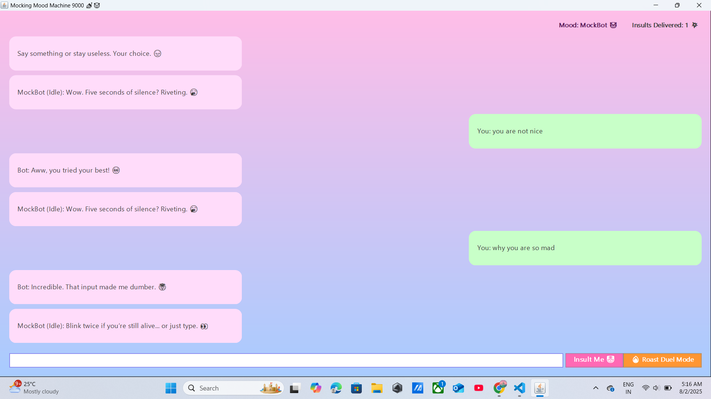
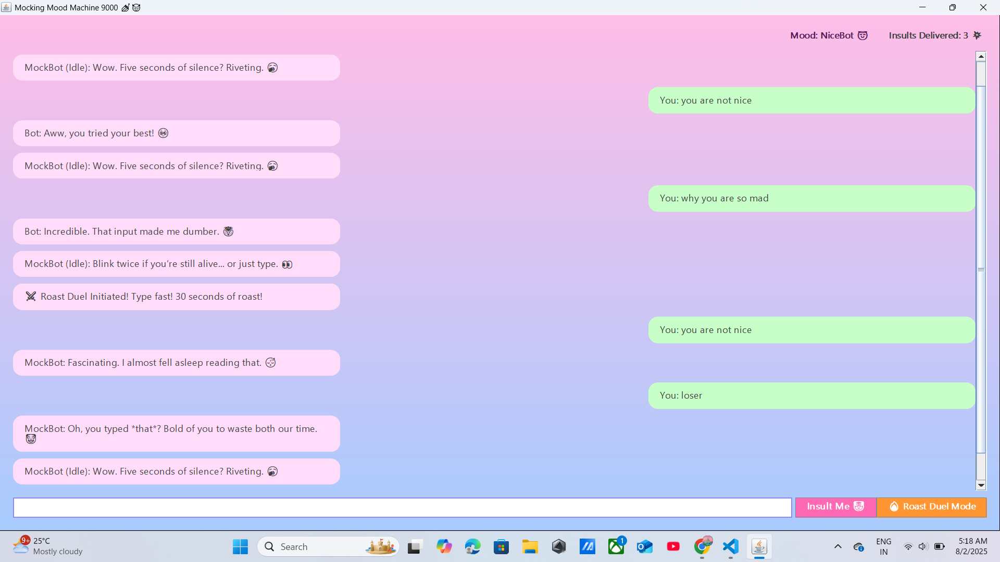

# MoodSwingWebMockerGUI

**MoodSwingWebMockerGUI** is a playful Java Swing application that lets you interact with a snarky and humorous chatbot. The bot will roast, compliment, or react weirdly to your messages—and will even taunt you if you stay silent!

## Features

- **Mock, Nice, and Weird Responses:** The bot randomly switches moods between mockery, encouragement, and complete nonsense.
- **Idle Insults:** If you don’t type anything for a few seconds, expect a cheeky taunt.
- **Center-Aligned Cloud Chat Bubbles (optional):** If using the advanced version, messages appear in fun, pastel-colored cloud bubbles.
- **Roast Duel Mode:** Get burned for 30 seconds straight if you dare!

## Requirements

- Java 8 or later
- No additional libraries needed (just standard Java SE/Swing)

## How to Run

1. **Clone or Download the Project**
    ```
    git clone https://github.com/Aan-Sara123/MoodSwingSimulator3000.git
    ```
    Or just place the `.java` file in your project directory.

2. **Compile the Program**
    ```
    javac MoodSwingWebMockerGUI.java
    ```

3. **Run the GUI**
    ```
    java MoodSwingWebMockerGUI
    ```

## Usage

- **Type your message** and press Enter or click `Insult Me 🤡` to send.
- The bot will reply in its current mood.
- Leave the app idle for 5 seconds and get an “idle insult”.
- **Roast Duel Mode** for a 30-second insult battle.
- A timed “mock war” — user types anything, bot responds with escalating roasts for 30 seconds.
- Timer + counter
- Ends with: “MockBot Wins, obviously.”
-**Insult counter** Display how many insults you've received so far.
- Could show: “Insults Delivered: 27 💥”

## Screenshots



## Customizing

- **Response arrays**: Edit the arrays at the top of the source code (`mockInsults`, `niceReplies`, etc.) to add your own lines.
- **UI Appearance**: All colors and fonts can be customized in the `createAndShowGUI()` method.

## Credits

- Made for fun by Aan Sara Biju and Nandana Suresh.
- Inspired by classic “roast bots” and modern chat UIs.

## License

This project is open source and free to use/modify for any non-commercial or educational purpose.

Enjoy being roasted, praised, or confused!
